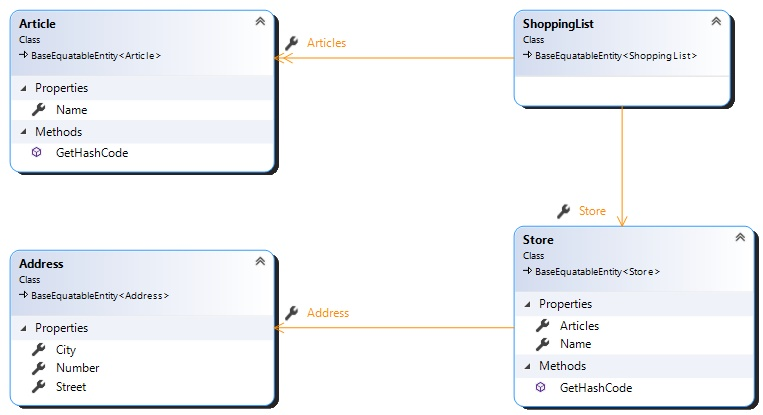

# Domain Classes

The domain is the heart of the application.  Our application evolves around articles, stores and shopping list as can be seen in the following class diagram.

The following base interface allows us setup some base action on the domain objects.

- IIdentifiable: Common interface to provide identification to an entity
- ICreatable: Interface containing audit information about creation of the entity
- IModifiable: Interface containing audit information about modifications of the entity 

